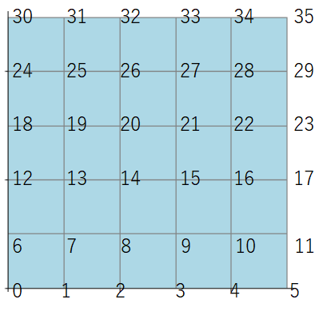
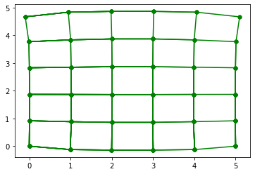
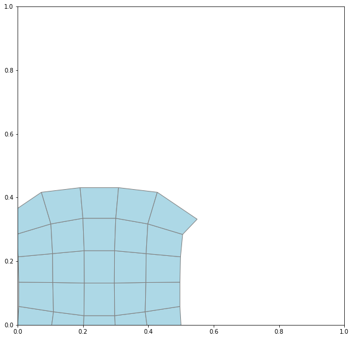

# simpleFEM

四角要素の組み合わせで作る、構造物のFEM解析プログラムです。

## 必要なライブラリのインポート
```python
import numpy as np  
import matplotlib.pyplot as plt  
import matplotlib.patches as pat  
import simpleFem #import simpleFem.pyからインポート
```
## 使い方
例として、横方向に5個、縦方向に5個の25個の格子ブロックを作成します。  
```python
fem = simpleFem.simpleFem([5,5]) # 横30×縦20の格子状の要素を作成
```
拘束条件と荷重条件を設定します。  
節点の番号の振り方は、下の段から順に番号が振られています。  
たとえば、5×5の場合は、  



と振られています。
```python

#拘束条件
fem.ux(0,0)#0番目の節点のx方向を拘束
fem.uy(0,0)#0番目の節点のy方向を拘束
fem.ux(5,0)#0番目の節点のx方向を拘束
fem.uy(5,0)#0番目の節点のy方向を拘束

#荷重
fem.fx(30,0) 
fem.fy(30,-10**6) #30番目の節点のy方向に-10^6MPaの荷重
fem.fx(35,0)
fem.fy(35,-10**6) #35番目の節点のy方向に-10^6MPaの荷重
```
要素の有無をここで設定します。
fem.bit[i]が0のときに要素が存在し、0のときは要素が存在しなくなります。
```python
#要素の選択
for i in range(fem.elm_num):
    fem.bit[i] = 1

#fem.bit[5] = 0
#fem.bit[14] = 0
#fem.bit[15] = 0
```
FEM計算を実行します
```python
#FEM計算
fem.calc_fem()
```
変位uを表示します。
```python
print(fem.u)
```

節点にかかる力fを表示します。
```python
print(fem.f)
```
各要素にかかるフォン・ミーゼス応力を表示します。
```python
print(fem.vms)
```
結果を描画します。  
引数aに描画の倍率を設定します。  
計算結果により、変位倍率が変わるために、微調整して表示させてください。  
a=0にすると変位を無視した格子要素が表示されます。  
grid=1を指定すると格子点のグリッドを表示します。　  
rateは要素の表示範囲の倍率をしていします。  
```python
fem.dsp_result(a=15**4,grid=1,rate=50) #a変位倍率 グリッド表示なし
```


```python
fem.dsp_result(a=15**4,grid=1,rate=50) #a変位倍率 グリッド表示
```


